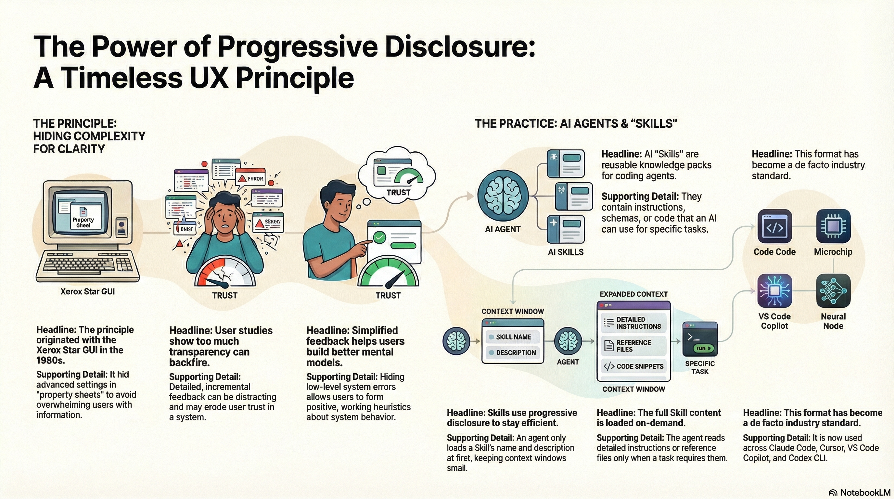

<p align="center">
  
</p>

<p align="center">
  <a href="#installation"></a>
  <a href="LICENSE"></a>
  <a href="#the-3-level-disclosure-model"></a>
</p>

<h1 align="center">Skills Performance Optimizer</h1>

<p align="center">
  <strong>Audit and optimize AI agent skills for token efficiency using a 40-year-old design principle.</strong>
</p>

---

## The Problem: Context is the Bottleneck

In an exploratory study of coding agents, researchers found that **token consumption for the same task ranged from 8,500 to over 190,000 tokens**—a 22x difference. The variable? How efficiently agents load context.

AI coding agents need to understand vast codebases comprising thousands of files and millions of lines of code. But the model's attention—its context window—is a finite and expensive resource. You cannot simply feed an entire codebase into a prompt.

**The quality of the code an agent generates is directly determined by the relevance of the code it can "see."**

---

## The Solution: A 40-Year-Old Design Principle

In 1981, designers at Xerox PARC faced a similar challenge: how to make powerful systems accessible without overwhelming users with complexity. Their answer was **progressive disclosure**—a principle that dictates:

> *"Detail should be hidden from users until they ask or need to see it."*

Decades later, psychology proved them right. Research on algorithmic transparency found that detailed, incremental feedback was often *counterproductive*—distracting users, exposing minor errors that eroded trust, and preventing the formation of simple, effective mental models.

**Today, this same principle is solving AI's biggest challenge.** The "Agent Skills" architecture—now adopted across Claude, Cursor, VS Code, GitHub Copilot, and OpenAI's Codex—applies progressive disclosure to manage LLM context windows by loading information on demand.

---

## What This Tool Does

**Skills Performance Optimizer** audits your Claude Code skills against the 3-level progressive disclosure model, identifying token waste and providing actionable optimization recommendations.

Think of an optimized skill like a **restaurant menu**:
- **Level 1 (Metadata)**: The cuisine name on the sign outside
- **Level 2 (SKILL.md)**: The menu itself
- **Level 3 (Nested Resources)**: Ingredients and nutritional facts kept in back

### Key Features

- **Token Footprint Analysis** — Measure Level 1, 2, and 3 token consumption
- **Violation Detection** — Identify bloated descriptions, voodoo constants, deep nesting
- **Actionable Recommendations** — Get specific fixes, not just warnings
- **A+ to F Grading** — Benchmark your skills against best practices
- **Batch Auditing** — Scan your entire skills directory at once

---

## Installation

### As a Claude Code Skill

```bash
# Copy to your skills directory
cp -R . ~/.claude/skills/optimizing-skills-performance

# Or symlink for development
ln -sf $(pwd) ~/.claude/skills/optimizing-skills-performance
```

### Standalone Usage

The scripts work without installation:

```bash
./scripts/analyze-skill.sh /path/to/skill
./scripts/audit-all-skills.sh ~/.claude/skills
./scripts/validate-skill.sh /path/to/skill
```

---

## Quick Start

### Analyze a Single Skill

```bash
./scripts/analyze-skill.sh ~/.claude/skills/my-skill
```

**Output includes:**
- Level 1 metadata analysis (name/description length)
- Level 2 body metrics (lines, tokens, code blocks)
- Level 3 resource inventory
- Violation detection with severity levels
- Final score (A+ to F)

### Audit All Skills

```bash
./scripts/audit-all-skills.sh ~/.claude/skills
```

Generates `audit-report.json` with per-skill metrics and comparative scores.

### Validate Before Publishing

```bash
./scripts/validate-skill.sh ~/.claude/skills/my-skill true
```

Returns pass/fail with detailed violation list—run this before committing.

---

## The 3-Level Disclosure Model

| Level | Loaded When | Target Size | Content |
|-------|-------------|-------------|---------|
| **Level 1** | Always (startup) | ~200 chars | `name` and `description` from YAML frontmatter |
| **Level 2** | On skill trigger | <500 lines, <4K tokens | SKILL.md body: quick start, workflow, navigation |
| **Level 3+** | On explicit access | Unlimited | Detailed docs, API refs, examples in `docs/` |

### Why This Matters

If you have 100 skills installed, each skill's Level 1 metadata is loaded at startup. At ~200 chars each, that's ~6KB of context—acceptable.

But if Level 2 content bleeds into Level 1 (bloated descriptions) or Level 3 content lives in Level 2 (inline code dumps), you're wasting precious context on information the agent doesn't need yet.

---

## What Gets Flagged

### Critical Violations (Must Fix)
| Code | Issue |
|------|-------|
| `C001` | Missing YAML frontmatter |
| `C002` | Missing required fields (name, description) |
| `C003` | Description exceeds 1024 characters |
| `C004` | Name exceeds 64 characters |

### High Severity (Should Fix)
| Code | Issue |
|------|-------|
| `H001` | Missing trigger condition ("Use when...") |
| `H002` | SKILL.md exceeds 500 lines |
| `H003` | Deep reference nesting (A → B → C) |
| `H004` | Large inline code blocks (>50 lines) |
| `H005` | Voodoo constants (explaining what Claude knows) |

### Scoring

| Grade | Score | Criteria |
|-------|-------|----------|
| **A+** | 95-100 | 0 critical, 0 high, ≤2 medium |
| **A** | 90-94 | 0 critical, 0 high, ≤4 medium |
| **B** | 80-89 | 0 critical, ≤2 high |
| **C** | 70-79 | 0 critical, ≤4 high |
| **D** | 60-69 | 0 critical, >4 high |
| **F** | 0-59 | Any critical violations |

---

## Industry Adoption

The `SKILL.md` format for packaging agent knowledge has been adopted across a range of influential coding tools:

> *"What surprised me is this isn't Claude-only anymore. The format got adopted by: Cursor, VS Code / GitHub Copilot, OpenAI's Codex CLI... So you can write a skill once and use it across tools. It's like how .editorconfig standardized formatting rules across editors, but for agent workflows."*

This tool helps you write skills that work everywhere.

---

## Project Structure

```
optimizing-skills-performance/
├── SKILL.md                 # Main skill file (Claude loads this)
├── README.md                # You are here
├── CLAUDE.md                # Instructions for Claude
├── docs/
│   ├── disclosure-levels.md # Full 3-level specification
│   ├── token-counting.md    # Measurement techniques
│   ├── naming-conventions.md # Gerund naming patterns
│   └── validation-rules.md  # Complete rule set
└── scripts/
    ├── analyze-skill.sh     # Single skill analysis
    ├── audit-all-skills.sh  # Batch audit
    └── validate-skill.sh    # Pass/fail validation
```

---

## Contributing

1. Fork this repository
2. Create a feature branch
3. Run validation: `./scripts/validate-skill.sh . true`
4. Submit a pull request

---

## License

MIT License — See [LICENSE](LICENSE) file for details.

---

## Further Reading

- [Disclosure Level Criteria](docs/disclosure-levels.md) — Full specification for each level
- [Token Counting Guide](docs/token-counting.md) — Accurate measurement techniques
- [Validation Rules](docs/validation-rules.md) — Complete rule set with examples
- [Naming Conventions](docs/naming-conventions.md) — Gerund forms and patterns

---

<p align="center">
  <em>The future of AI is not about providing all the information.<br>It's about designing for its timely and intentional disclosure.</em>
</p>
